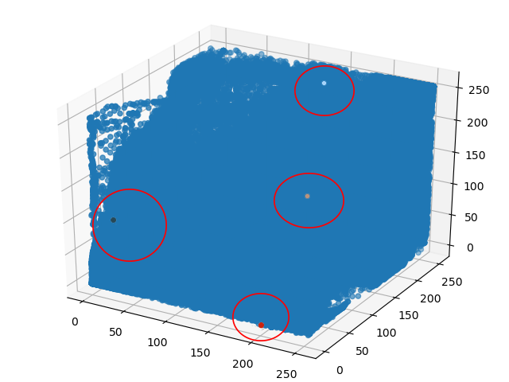
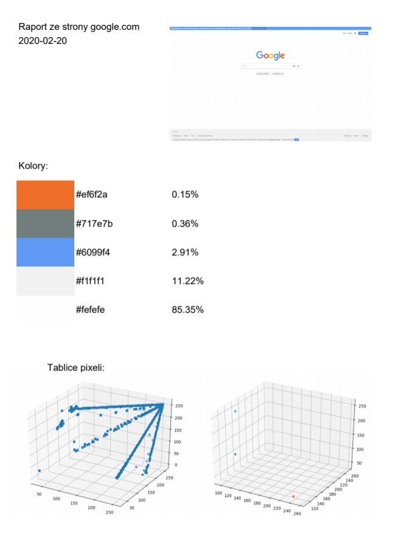

# dominant_color
Python dominant color out of a webpage.
My bachelor's work with Python.
Libraries used:
- opencv-python (cv2)
- NumPy (numpy)
- Matplotlib (pyplot)
- Axes3D
- Selenium (webdriver)
- Sklean (Kmeans)
- FPDF (pdf)
Steps: Screen capture -> Pixel array -> 3D Graph -> Clustering colors -> Printing out .pdf
## Example:
Screen capture from the site using Selenium.

## Array dots:
Turning array into 3D graph to clarify. Dominant n-colors are marked.

## Data:
Program saves those files along with percentage.
```
Colors.txt
#ef6f2a 0.15%
#717e7b 0.36%
#6099f4 2.91%
#f1f1f1 11.22%
#fefefe 85.35%
```
## PDF Report
Then using FPDF we are turning data into a self-made report.

