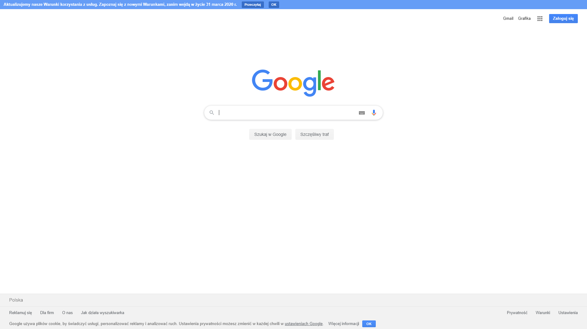

# dominant_color
Python dominant color out of a webpage.
My bachelor's work with Python.
Libraries used:
- opencv-python (cv2)
- NumPy (numpy)
- Matplotlib (pyplot)
- Axes3D
- Selenium (webdriver)
- Sklean (Kmeans)
Steps: Screen capture -> Pixel array -> 3D Graph -> Clustering colors -> Printing out .pdf
## Example: Google.com

